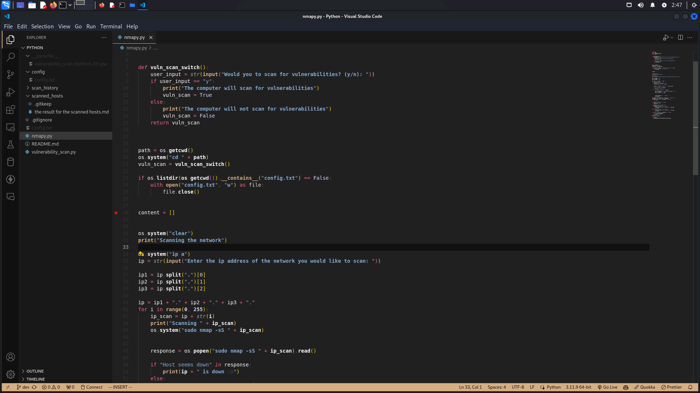

<!---
[French version](https://moineau54.github.io/Moineau-s-french-tech-corner/2024/07/12/Mes-aventures-dans-la-programmation-avec-un-Raspberry-Pi.html) | [German version](https://moineau54.github.io/Moineau-s-german-tech-corner/2024/07/12/Meine-Programmierreise-mit-einem-Raspberry-Pi.html)

--->

# Nmap Host Vulnerability Scanner Script

What a strange name, right?\
Nmap, what is that?\
Vulnerability scanner?\
Script?\
What is this all about?\
Let me explain.

## 1. What is Nmap?

Nmap is a free and open-source network scanner created by Gordon Lyon. It is used to discover hosts and services on a computer network, thus creating a "map" of the network. To accomplish its goal, Nmap sends specially crafted packets to the target host and then analyzes the responses. Nmap provides a number of features for probing computer networks, including host discovery and service and operating system detection. These features are extensible by scripts that provide more advanced service detection, vulnerability detection, and other features.

[link to the official website](https://nmap.org/)

## 2. What is a vulnerability scanner?

A vulnerability scanner is a computer program designed to assess computers, computer systems, networks, or applications for weaknesses. These weaknesses can range from simple configuration errors to critical vulnerabilities in software. Vulnerability scanners are used by security professionals to identify security holes that could be exploited by attackers.

In this case, I will be using Nmap as a vulnerability scanner to identify weaknesses in a target host by scanning for hosts on the current network and then scanning those hosts for vulnerabilities by using Nmap scripts. With my script, I automated the calls with the vulners.nse script. This script uses the Vulners API to check for vulnerabilities in the target host.

## 3. The script

The [script](https://github.com/Moineau54/nhvss_python) I created is a simple python script that first scans the network for hosts and then scans those hosts for vulnerabilities using the vulners.nse script.

## So ... why did I create this script?

I created this script to automate the process of scanning for vulnerabilities on my home network. I wanted to know if there were any vulnerabilities on my network that could be exploited by attackers and how to fix them. Fortunately, the vulners.nse script provides detailed information about the vulnerabilities it finds, including the CVE number, the severity of the vulnerability, and a link to its entry on the Vulners website. This information is very useful for security professionals who need to assess the security of their network and take appropriate action to fix any vulnerabilities that are found.

## But ... why should you care?

You should care about the security of your network because it is your responsibility to protect your data and your privacy. If your network is not secure, attackers could gain access to your data and use it for malicious purposes. By scanning your network for vulnerabilities, you can identify and fix security holes before they are exploited by attackers. This will help you protect your data and your privacy and ensure that your network is secure.

## Conclusion

I created this script, first and foremost, to see if my computers were secure. I wanted to know if there were any vulnerabilities on my network that could be exploited by attackers and how to fix them. I also wanted to learn more about Nmap and how it can be used as a vulnerability scanner. Secondly, I used it as challenge to myself, to see if I could create a useful tool that could help me improve the security of my network.

A big shoutout to the creators of Nmap and the vulners.nse script for providing such a powerful tool for security professionals and to my friend [ByteOtter](https://github.com/ByteOtter) for helping me with the script, he is a great guy and a great programmer.

## Warning

This script is currently a work in progress, so beware of bugs or the script not working properly for the time being.
